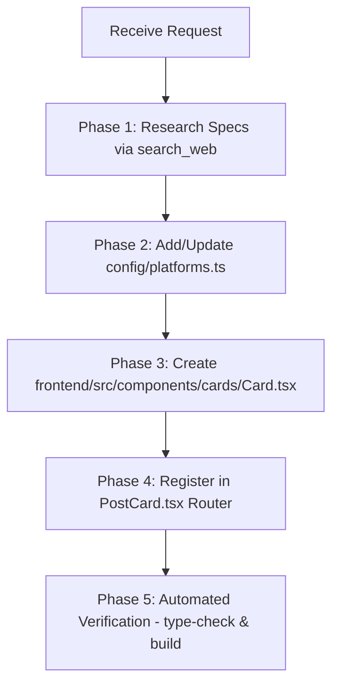

# 🎨 Postmaker Card Creator (God-Level Native Skill)

The authoritative design and engineering specification for creating and updating platform preview cards in Postmaker.

---

## 🏛️ 1. Core Architectural Guidelines

### 1. Component Isolation Rule
- Every social platform MUST have its own dedicated, isolated card component located in `frontend/src/components/cards/<PlatformName>Card.tsx`.
- `frontend/src/components/PostCard.tsx` acts exclusively as a router mapping `platformId` to `<PlatformName>Card`.
- **NEVER** write monolithic switch-statements with inline JSX inside `PostCard.tsx`.

### 2. Interface Contract
All platform cards MUST implement the shared `CardProps` interface defined in `frontend/src/components/cards/types.ts`:

```typescript
export interface CardProps {
  platformId: string
  post: Post
  campaignId?: string
  imageFiles: File[]
  videoFile: File | null
  onOpenRefinement: () => void
}
```

### 3. Zero Fake Mock Metrics Rule
- **NEVER** hardcode fake engagement counts (e.g., fake `14.2k` likes, `3.8k` retweets).
- Initial counts MUST start at clean `0` (or `1` for self-upvote platforms like Reddit, Hacker News, Product Hunt, Stack Overflow).
- Implement interactive state handlers (`useState`) for likes/upvotes/boosts so the preview card reacts dynamically to user clicks in real time.

### 4. Light Mode Default & Native Aesthetics
- Unless a platform is inherently a mobile phone camera overlay (e.g., Snapchat/YouTube Shorts/TikTok frames), preview cards MUST default to **authentic Light Mode** (`#ffffff` background, sharp border tokens, high contrast text).
- Color tokens MUST match the real platform's official brand palette:
  - **LinkedIn**: `#0A66C2`
  - **Twitter / X**: `#1D9BF0`
  - **Instagram**: Gradient `#E4405F` / `#C13584`
  - **Reddit**: `#FF4500`
  - **Discord**: `#5865F2` (gg sans font + Light Mode `#ffffff`)
  - **Mastodon**: `#6364FF` (Light Mode `#ffffff`)
  - **GitHub**: `#24292E` / `#0969DA`
  - **Substack**: `#FF6719`
  - **Indie Hackers**: `#0E2150`
  - **WhatsApp**: `#25D366` / Chat bubble `#e7ffdb`
  - **Dribbble**: `#EA4C89` (4:3 aspect ratio)
  - **Stack Overflow**: `#F48024` (2-column Stacks layout)
  - **Quora**: `#B92B27`
  - **Hashnode**: `#2962FF`
  - **Twitch**: `#9146FF`

### 5. Web Search Spec Verification
- Before building a new card or updating an existing layout, execute `search_web` for the exact platform UI components:
  ```bash
  search_web query="<PlatformName> post UI component layout design specs typography"
  ```
- Identify exact aspect ratios, action button icons, badge placements, drop-caps, and tag styling before writing code.

---

## 🛠️ 2. Step-by-Step Workflow for Adding / Updating Cards



### Phase 1: Research & Spec Extraction
1. Search web for exact platform UI components and layout rules.
2. Determine:
   - Primary character limit
   - Aspect ratio for media (16:9, 4:3, 3:4, 9:16, 1:1)
   - Profile header structure (Avatar size, handle format, time indicator, privacy badge)
   - Action bar buttons (Like, Comment, Repost/Share, Save/Bookmark)

### Phase 2: Platform Registration (`config/platforms.ts`)
If introducing a new platform, add its definition to `config/platforms.ts`:
```typescript
export const PLATFORMS: PlatformConfig[] = [
  // ...
  {
    id: 'myplatform',
    name: 'My Platform',
    category: 'social',
    icon: 'SiMyplatform',
    charLimit: 500,
    maxImages: 4,
    imagePosition: 'inline',
    aspectRatio: '16:9',
    shareUrl: (text) => `https://myplatform.com/post?text=${encodeURIComponent(text)}`
  }
]
```

### Phase 3: Create Isolated Card Component
Create `frontend/src/components/cards/<PlatformName>Card.tsx` using the standard 4-part structure:
1. **Top Control Toolbar**: Platform icon, title, status dot, Refine button, Copy button, Download Kit button.
2. **Native Card Box**: 1:1 authentic layout container with inline CSS scoping via unique 2-letter or 3-letter prefix (e.g. `.mp-post-box`).
3. **Formatted Content & Media Grid**: Render text with `#hashtag` and `@mention` highlights, media grid frame, interactive reaction buttons.
4. **Bottom Control Bar**: Character counter, shortcut hint (`⌘↵ save · Esc cancel`), and share link.

### Phase 4: Register Router Branch in `PostCard.tsx`
Import the component and add a dispatch condition:
```typescript
import { MyPlatformCard } from './cards/MyPlatformCard'

// Inside PostCard:
if (platformId === 'myplatform') {
  return <MyPlatformCard {...props} />
}
```

### Phase 5: Automated Build & Type-Check Verification
Run terminal verification commands:
```bash
npm run type-check
npm run build
```
Verify **0 errors** before declaring completion.

---

## 📋 3. Standard Card Component Template

When creating a new card, use this high-craft template as a foundation:

```tsx
import { useState, useRef, useEffect, useMemo } from 'react'
import { Copy, Download, Check, Sparkles } from 'lucide-react'
import { PLATFORM_MAP } from '@@config/platforms'
import { useAppStore } from '../../store/app'
import { PlatformIcon } from '../PlatformIcon'
import { generateClientZip, sanitize } from '../../lib/downloadKit'
import type { CardProps } from './types'

function FormattedContent({ content, linkColor }: { content: string; linkColor?: string }) {
  const color = linkColor || '#0066CC'
  const elements = useMemo(() => {
    const parts = content.split(/(\s+)/)
    return parts.map((part, idx) => {
      if ((part.startsWith('#') || part.startsWith('@')) && part.length > 1) {
        return (
          <span key={idx} style={{ color, fontWeight: 700, cursor: 'pointer' }}>
            {part}
          </span>
        )
      }
      if (part.match(/^https?:\/\/[^\s]+/)) {
        return (
          <a key={idx} href={part} target="_blank" rel="noopener noreferrer" style={{ color, textDecoration: 'none', fontWeight: 600 }}>
            {part}
          </a>
        )
      }
      return part
    })
  }, [content, color])

  return <>{elements}</>
}

export function NewPlatformCard({ platformId, post, campaignId, imageFiles, videoFile, onOpenRefinement }: CardProps) {
  const { user, updatePost, addToast } = useAppStore()
  const platform = PLATFORM_MAP[platformId]

  const [imageUrls, setImageUrls] = useState<string[]>([])
  const [copied, setCopied] = useState(false)
  const [downloading, setDownloading] = useState(false)
  const [isEditing, setIsEditing] = useState(false)
  const [editValue, setEditValue] = useState(post.content)

  const textareaRef = useRef<HTMLTextAreaElement>(null)
  const userName = user?.name || 'Your Brand'

  useEffect(() => {
    if (!platform || platform.maxImages === 0 || platform.imagePosition === 'none' || imageFiles.length === 0) {
      setImageUrls([])
      return
    }
    const urls = imageFiles.slice(0, platform.maxImages).map((f: File) => URL.createObjectURL(f))
    setImageUrls(urls)
    return () => { urls.forEach((url: string) => URL.revokeObjectURL(url)) }
  }, [imageFiles, platform])

  useEffect(() => { if (!isEditing) setEditValue(post.content) }, [post.content, isEditing])

  const handleCopy = async () => {
    await navigator.clipboard.writeText(post.content)
    setCopied(true)
    addToast('Post copied', 'success')
    setTimeout(() => setCopied(false), 2000)
  }

  const handleDownload = async () => {
    if (!campaignId || downloading) return
    setDownloading(true)
    try {
      const prompt = useAppStore.getState().campaign?.prompt || ''
      const zipBlob = await generateClientZip(campaignId, prompt, [post], imageFiles, videoFile, () => {})
      const url = URL.createObjectURL(zipBlob)
      const a = document.createElement('a')
      a.href = url
      a.download = `${sanitize(platform?.name || 'Platform')}_kit.zip`
      a.click()
      setTimeout(() => URL.revokeObjectURL(url), 1000)
      addToast('Kit downloaded', 'success')
    } catch (err) {
      addToast('Download failed', 'error')
    } finally {
      setDownloading(false)
    }
  }

  const handleEditSave = () => {
    const trimmed = editValue.trim()
    if (trimmed && trimmed !== post.content) {
      updatePost(platformId, { content: trimmed, edited: true })
    }
    setIsEditing(false)
  }

  const shareUrl = platform?.shareUrl(post.content, {})
  const charCount = post.content.length

  return (
    <div className="np-card-wrapper">
      {/* Top Control Bar */}
      <div className="np-control-bar">
        <div className="np-control-platform">
          <PlatformIcon id={platformId} size={15} color="#0066CC" />
          <span className="np-control-title">{platform?.name || 'Platform'}</span>
          <span className="np-ready-badge">• Ready</span>
        </div>
        <div className="np-control-actions">
          <button className="np-tool-btn" onClick={onOpenRefinement}><Sparkles size={12} /><span>Refine</span></button>
          <button className="np-tool-btn" onClick={handleCopy}>{copied ? <Check size={12} /> : <Copy size={12} />}<span>{copied ? 'Copied' : 'Copy'}</span></button>
          <button className="np-tool-btn" onClick={handleDownload} disabled={downloading}><Download size={12} /><span>Kit</span></button>
        </div>
      </div>

      {/* Card Content Container */}
      <div className={`np-post-box ${isEditing ? 'editing' : ''}`}>
        <div className="np-body" onClick={() => !isEditing && setIsEditing(true)}>
          {isEditing ? (
            <textarea
              ref={textareaRef}
              className="np-edit-textarea"
              value={editValue}
              onChange={e => setEditValue(e.target.value)}
              onBlur={handleEditSave}
              autoFocus
            />
          ) : (
            <p className="np-text"><FormattedContent content={post.content} /></p>
          )}
        </div>
      </div>

      {/* Bottom Bar */}
      <div className="np-footer-bar">
        <span className="np-footer-chars">{charCount} chars</span>
        {shareUrl && <a href={shareUrl} target="_blank" rel="noopener noreferrer" className="np-footer-share">Post →</a>}
      </div>
    </div>
  )
}
```

---

## ⚡ 4. Quality Gate Checklist

Before completing any card work:
- [ ] Card component resides in `frontend/src/components/cards/<PlatformName>Card.tsx`.
- [ ] Registered in `frontend/src/components/PostCard.tsx`.
- [ ] No hardcoded fake mock counts (starts at clean `0` or `1`).
- [ ] Supports live in-place inline editing with `textarea`.
- [ ] Styled with Light Mode default or authentic dark phone frame.
- [ ] Passes `npm run type-check` with **0 errors**.
- [ ] Passes `npm run build` with clean bundle generation.
