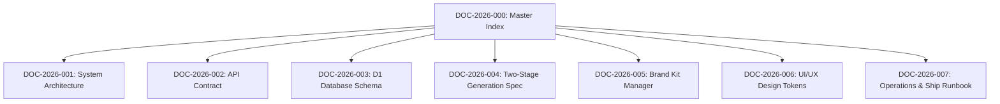

# PostMaker Master Doc Index & Relationship Registry

Update this table and graph whenever a doc is created, updated, or deprecated.

---

## Documentation Relationships Graph

---

## Active Document Registry

| Doc ID | Category | Title | Path | Status | Last Updated |
| :--- | :--- | :--- | :--- | :--- | :--- |
| **DOC-2026-000** | Architecture | [Master Doc Index](file:///c:/Users/golde/OneDrive/Desktop/bypostmaker/docs/docs-index.md) | `docs/docs-index.md` | `Stable` | 2026-07-31 |
| **DOC-2026-001** | Architecture | [System Architecture](file:///c:/Users/golde/OneDrive/Desktop/bypostmaker/docs/architecture/system-overview.md) | `docs/architecture/system-overview.md` | `Stable` | 2026-07-31 |
| **DOC-2026-002** | API | [PostMaker API Contract](file:///c:/Users/golde/OneDrive/Desktop/bypostmaker/docs/api/postmaker-api-contract.md) | `docs/api/postmaker-api-contract.md` | `Stable` | 2026-07-31 |
| **DOC-2026-003** | Database | [D1 Database Schema](file:///c:/Users/golde/OneDrive/Desktop/bypostmaker/docs/database/d1-schema-spec.md) | `docs/database/d1-schema-spec.md` | `Stable` | 2026-07-31 |
| **DOC-2026-004** | Feature | [Two-Stage Generation Spec](file:///c:/Users/golde/OneDrive/Desktop/bypostmaker/docs/features/two-stage-generation.md) | `docs/features/two-stage-generation.md` | `Stable` | 2026-07-31 |
| **DOC-2026-005** | Feature | [Brand Kit Manager](file:///c:/Users/golde/OneDrive/Desktop/bypostmaker/docs/features/brand-kit.md) | `docs/features/brand-kit.md` | `Stable` | 2026-07-31 |
| **DOC-2026-006** | UI/UX | [Vanilla CSS Design Tokens](file:///c:/Users/golde/OneDrive/Desktop/bypostmaker/docs/ui-ux/design-system-tokens.md) | `docs/ui-ux/design-system-tokens.md` | `Stable` | 2026-07-31 |
| **DOC-2026-007** | Operations | [Shipping Runbook](file:///c:/Users/golde/OneDrive/Desktop/bypostmaker/docs/operations/shipping-runbook.md) | `docs/operations/shipping-runbook.md` | `Stable` | 2026-07-31 |
