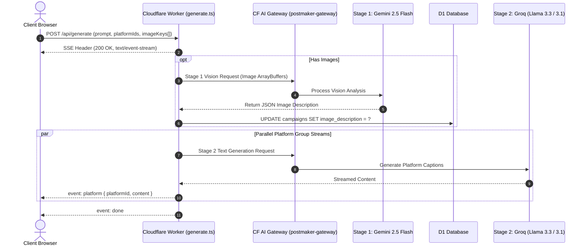

# 🏛️ PostMaker — System Architecture & Technical Specifications

Consolidated technical specification covering System Overview, AI Pipeline, API Contracts, D1 Schema, and Design System.

---

## 1. 🏗️ Tech Stack & Overview

- **Frontend**: React 18, Vite, React Router DOM v6, Zustand (`frontend/src/store/app.ts`), Vanilla CSS (`globals.css`).
- **Backend Worker**: Cloudflare Workers (`wrangler`), TypeScript runtime (`workerd`).
- **AI Engine**: Vercel AI SDK (`@ai-sdk/google`, `@ai-sdk/groq`), Cloudflare AI Gateway (`postmaker-gateway`).
- **Storage & Database**: Cloudflare R2 Bucket (`postmaker-uploads`), Cloudflare D1 SQLite Database (`postmaker-db`).

---

## 2. ⚡ Two-Stage AI Generation Pipeline

- **Stage 1 (Vision)**: `analyzeImage(env, imagePayloads)` calls `gemini-2.5-flash` ONCE to extract structured JSON (subjects, mood, setting, colors, details).
- **Stage 2 (Text)**: `streamGenerate` injects `image_description` into prompt text and generates platform captions in parallel via Groq.

---

## 3. 🔌 API Contract Summary

- `POST /api/generate`: SSE stream endpoint returning `start`, `init`, `vision`, `platform`, `done`, and `fatal` events.
- `POST /api/upload/presign-batch`: Generates presigned S3 R2 upload URLs for client image uploads.
- `GET /api/auth/dev`: Development mode authentication bypass (returns `pm_session` cookie).

---

## 4. 🗄️ Cloudflare D1 Database Schema Summary

- `users`: `id`, `email`, `name`, `plan` (`free` | `starter` | `pro` | `business`), `created_at`.
- `campaigns`: `id`, `user_id`, `prompt`, `image_description`, `created_at`.
- `posts`: `id`, `campaign_id`, `platform_id`, `content`, `status`, `created_at`.
- `brand_kits`: `id`, `user_id`, `name`, `voice`, `brand_guidelines`, `updated_at`.

---

## 5. 🎨 Design System Tokens (`frontend/src/styles/globals.css`)

- **Primary Colors**: `var(--color-primary-start)` (`#38BDF8`), `var(--color-primary-end)` (`#0284C7`).
- **Liquid Glass Surfaces**: `var(--color-surface)` (`rgba(15, 28, 48, 0.58)` + `backdrop-filter: blur(36px)`).
- **Borders & Shadows**: `var(--color-border)` (`rgba(255, 255, 255, 0.22)`), `var(--shadow-card)`.
