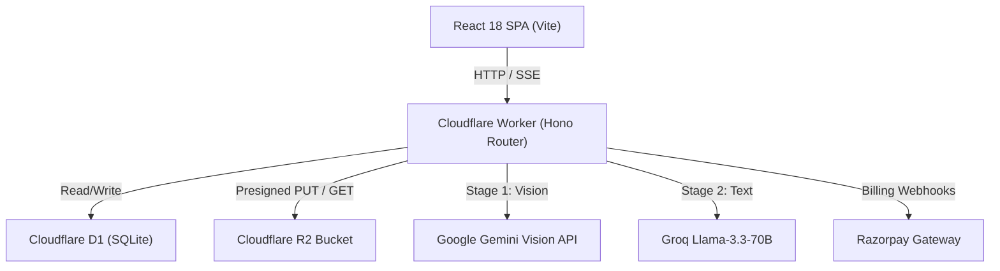

# System Architecture & Tech Stack Reference

## Documentation Relationships

- **Depends On**:
  - [DOC-2026-000: Master Index](file:///c:/Users/golde/OneDrive/Desktop/bypostmaker/docs/docs-index.md)
- **Used By**:
  - [DOC-2026-002: API Contract Spec](file:///c:/Users/golde/OneDrive/Desktop/bypostmaker/docs/api/postmaker-api-contract.md)
  - [DOC-2026-004: Two-Stage Generation Spec](file:///c:/Users/golde/OneDrive/Desktop/bypostmaker/docs/features/two-stage-generation.md)
- **Related Database Tables**:
  - `users`, `campaigns`, `posts`, `brand_kits`, `subscriptions`

---

## AI Context & Guardrails

> [!IMPORTANT]
> **Strict Operational Context for AI Agents & Automated Tools**

- **Purpose**: High-level system architecture guide defining frontend, backend worker, database, object storage, and AI generation topology.
- **Inputs**: Client HTTP requests, presigned S3 binary uploads, OAuth callbacks, Razorpay payment webhooks.
- **Outputs**: React SPA UI rendering, SSE post generation streams, Cloudflare D1 query results, R2 stored assets.
- **Dependencies**: React 18, Vite, Cloudflare Workers, `@aws-sdk/client-s3`, `@ailink/sdk`, `@ai-sdk/google`, `@ai-sdk/groq`.
- **Constraints**: Cloudflare Worker 30s subrequest limit, local `workerd` Windows ARM64 binary patch requirements.
- **Business Rules**: All static styling must use Vanilla CSS tokens (`globals.css`); zero Tailwind CSS allowed.
- **Edge Cases**: Offline client reconnection, AI rate-limit fallback routing, presigned URL S3 checksum validation.
- **Failure Modes**: 401 Unauthorized session errors, 429 AI rate limits, 500 S3 upload errors.
- **Performance Targets**: Frontend initial load < 800ms, Stage 1 Vision analysis < 15s, Stage 2 Text generation < 10s.
- **Security Guardrails**: HTTP-only JWT session cookies (`pm_session`), strict Razorpay webhook signature verification, owner-locked asset streaming.
- **DO NOT CHANGE**: Two-Stage AI pipeline division, Vanilla CSS design token system, `scripts/ship.sh` deploy workflow.

---

## System Topology & Request Flow

---

## Tech Stack Specification

| Component | Technology | Canonical Path | Description |
| :--- | :--- | :--- | :--- |
| **Frontend UI** | React 18 + Vite | [`frontend/src/App.tsx`](file:///c:/Users/golde/OneDrive/Desktop/bypostmaker/frontend/src/App.tsx) | Client SPA with React Router v6 & Zustand stores. |
| **Design Tokens** | Vanilla CSS | [`frontend/src/styles/globals.css`](file:///c:/Users/golde/OneDrive/Desktop/bypostmaker/frontend/src/styles/globals.css) | Custom CSS properties (`--color-primary`, Plus Jakarta Sans). |
| **Backend Worker** | Cloudflare Workers | [`worker/src/index.ts`](file:///c:/Users/golde/OneDrive/Desktop/bypostmaker/worker/src/index.ts) | Edge runtime worker providing API endpoints & AI routing. |
| **Database** | Cloudflare D1 | [`db/migrations/`](file:///c:/Users/golde/OneDrive/Desktop/bypostmaker/db/migrations) | Edge SQLite database for users, campaigns, posts, and subscriptions. |
| **Storage** | Cloudflare R2 | [`worker/src/routes/upload.ts`](file:///c:/Users/golde/OneDrive/Desktop/bypostmaker/worker/src/routes/upload.ts) | S3-compatible asset bucket with presigned upload URLs. |
| **AI Routing** | `@ailink/sdk` | [`config/ai.ts`](file:///c:/Users/golde/OneDrive/Desktop/bypostmaker/config/ai.ts) | Two-stage Vision (Gemini) + Text (Groq) generation pipeline. |

---

## Evidence & Verification

| Claim / Behavior | Evidence Source | Verification Link / Code | Verified By | Last Verified |
| :--- | :--- | :--- | :--- | :--- |
| Worker routes use Hono framework | Code Inspection | [`worker/src/index.ts#L1-L30`](file:///c:/Users/golde/OneDrive/Desktop/bypostmaker/worker/src/index.ts#L1-L30) | System Architect | 2026-07-31 |
| Frontend uses Vanilla CSS tokens | Style Inspection | [`frontend/src/styles/globals.css#L1-L50`](file:///c:/Users/golde/OneDrive/Desktop/bypostmaker/frontend/src/styles/globals.css#L1-L50) | Frontend Lead | 2026-07-31 |
| Local dev server starts cleanly | Terminal Build Log | `task-67` logs | Lead Engineer | 2026-07-31 |

---

## Living Status & Technical Debt

### Open Questions
- [ ] Should we cache generated image descriptions in D1 for 30 days to save Gemini quota on duplicate prompts?

### Technical Debt
- [ ] `workerd` npm binary on Windows ARM64 requires custom platform patching (`knownPackages`).

### Known Limitations
- Cloudflare Worker subrequest limit (30s) prevents long synchronous loops; requires SSE streaming.

### Future Improvements
- Add WebSocket support for real-time multi-user campaign collaboration.
