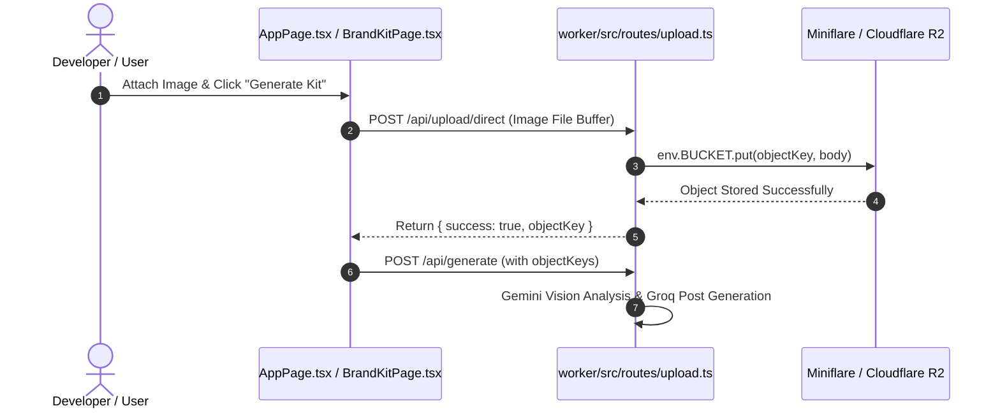

# BUG-2026-001: Local Development R2 Presigned Upload CORS Failure

## Executive Summary

When attaching an image in `wrangler dev` (local development mode), clicking **Generate Kit** causes the pre-generation storage phase to fail. The browser attempted a direct `PUT` request to Cloudflare R2 (`https://{ACCOUNT_ID}.r2.cloudflarestorage.com`), which was blocked due to local CORS restrictions or missing live R2 credentials in `.dev.vars`. The frontend catch block in `AppPage.tsx` aborted execution before calling `/api/generate`, preventing Stage 1 Vision analysis and Stage 2 caption generation from starting.

---

## 🔍 Root Cause Analysis

1. **Pre-Generation Storage Phase (`AppPage.tsx:L91-L105`)**:
   Before initiating the SSE stream `/api/generate`, the frontend called `api.upload.presignBatch()` to request presigned upload URLs.

2. **Backend S3 URL Generation (`upload.ts:L114-L130`)**:
   `handlePresignBatchRoute` generated AWS S3 presigned PUT URLs pointing directly to live Cloudflare R2 storage:
   `https://{CLOUDFLARE_ACCOUNT_ID}.r2.cloudflarestorage.com/{BUCKET_NAME}/uploads/{userId}/{uuid}.ext`

3. **Local Development Failure**:
   - In `wrangler dev`, Miniflare stores R2 objects locally in `.wrangler/state/v3/r2`.
   - The browser running on `localhost:5173` attempted an HTTP `PUT` to `r2.cloudflarestorage.com`.
   - Lacking live Cloudflare R2 CORS rules for `localhost:5173` or live S3 API keys, the browser's `fetch(uploadUrl, { method: 'PUT' })` failed with CORS / 403 Forbidden.

4. **Silent Pre-Generate Abort (`AppPage.tsx:L126-L133`)**:
   When `fetch(item.uploadUrl)` failed, `AppPage.tsx` caught the exception, reset `setIsGenerating(false)`, displayed an upload error toast, and returned without calling `/api/generate`.

---

## ✅ Implemented Solution: Native `env.BUCKET.put()` Direct Upload

AWS S3 presigned URLs were completely replaced with **Native Worker Direct Uploads** (`POST /api/upload/direct`):

1. **Worker Route (`upload.ts`)**:
   - Implemented `handleDirectUploadRoute` accepting raw binary image payloads via `request.body`.
   - Writes directly to `env.BUCKET.put(objectKey, body, { httpMetadata: { contentType } })`.
   - Stripped `@aws-sdk/client-s3` and `@aws-sdk/s3-request-presigner` dependencies from `worker/package.json`.

2. **Environment Parity**:
   - In **Local Dev (`wrangler dev`)**: Miniflare automatically routes `env.BUCKET.put()` to local disk storage (`.wrangler/state/v3/r2`). Works 100% offline without CORS or S3 secrets.
   - In **Production**: Streams directly to live Cloudflare R2 cloud storage.

3. **Frontend Integration (`api.ts`, `AppPage.tsx`, `BrandKitPage.tsx`)**:
   - Added `api.upload.direct(file: File)`.
   - Updated campaign creation and Brand Kit logo uploads to stream directly via `api.upload.direct(file)`.

---

## 📊 Sequence Diagram

