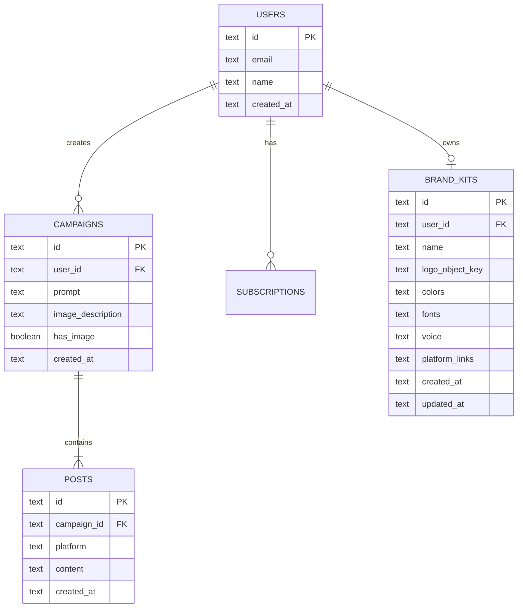

# Cloudflare D1 Database Schema Specification

## Documentation Relationships

- **Depends On**:
  - [DOC-2026-001: System Architecture](file:///c:/Users/golde/OneDrive/Desktop/bypostmaker/docs/architecture/system-overview.md)
- **Used By**:
  - [DOC-2026-002: API Contract Spec](file:///c:/Users/golde/OneDrive/Desktop/bypostmaker/docs/api/postmaker-api-contract.md)
  - [DOC-2026-005: Brand Kit Manager Architecture](file:///c:/Users/golde/OneDrive/Desktop/bypostmaker/docs/features/brand-kit.md)

---

## AI Context & Guardrails

> [!IMPORTANT]
> **Operational Guardrails for AI Agents**

- **Purpose**: Schema specification for Cloudflare D1 SQLite database (`postmaker-db`).
- **Inputs**: Migration SQL scripts located in [`db/migrations/`](file:///c:/Users/golde/OneDrive/Desktop/bypostmaker/db/migrations).
- **Outputs**: D1 tables: `users`, `campaigns`, `posts`, `subscriptions`, `brand_kits`, `usage`.
- **Dependencies**: Cloudflare D1 CLI (`wrangler d1 migrations apply`).
- **Constraints**: SQLite dialect; case-sensitive column names in `snake_case`.
- **Business Rules**: `user_id` foreign key cascade deletes; `brand_kits` table enforces 1 primary kit per user.
- **DO NOT CHANGE**: Migration tag history order or primary key type (`TEXT` UUIDs).

---

## Entity Relationship Diagram (ERD)

---

## Core Tables Overview

| Table Name | Description | Key Columns | Migration File |
| :--- | :--- | :--- | :--- |
| `users` | User accounts & OAuth profiles | `id`, `email`, `name`, `created_at` | `db/migrations/0001_initial.sql` |
| `campaigns` | Post generation campaigns | `id`, `user_id`, `prompt`, `image_description` | `db/migrations/0002_campaigns.sql` |
| `posts` | Multi-platform generated posts | `id`, `campaign_id`, `platform`, `content` | `db/migrations/0002_campaigns.sql` |
| `subscriptions` | Razorpay billing subscriptions | `id`, `user_id`, `plan`, `status` | `db/migrations/0004_billing.sql` |
| `brand_kits` | User brand voice & design assets | `id`, `user_id`, `colors`, `platform_links` | `db/migrations/0007_extend_brand_kit.sql` |

---

## Evidence & Verification

| Claim / Behavior | Evidence Source | Verification Link / Code | Verified By | Last Verified |
| :--- | :--- | :--- | :--- | :--- |
| Migration 0007 adds `platform_links` | SQL Migration File | [`db/migrations/0007_extend_brand_kit.sql#L1-L10`](file:///c:/Users/golde/OneDrive/Desktop/bypostmaker/db/migrations/0007_extend_brand_kit.sql#L1-L10) | Database Lead | 2026-07-31 |
| Dev D1 database binding name is `postmaker-db-dev` | Config File | [`wrangler.toml#L64`](file:///c:/Users/golde/OneDrive/Desktop/bypostmaker/wrangler.toml#L64) | DevOps Lead | 2026-07-31 |
