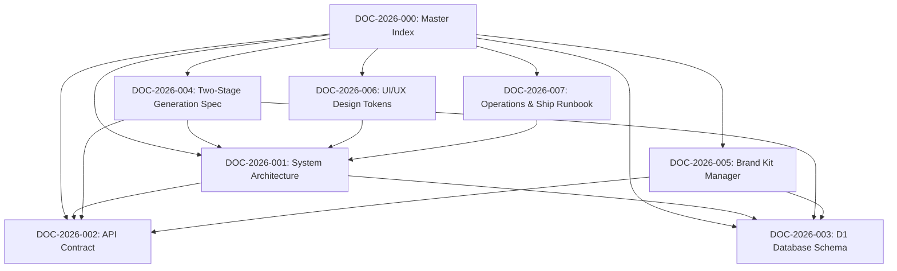

# PostMaker Master Documentation Index & Documentation Graph

Welcome to the canonical Documentation Hub for PostMaker. Every document in this repository follows the [PostMaker Senior Documentation Lead & DMS Standard](file:///c:/Users/golde/OneDrive/Desktop/bypostmaker/skills/postmaker-docs-lead/SKILL.md).

---

## Documentation Graph & Hierarchy

---

## Document Registry by Category

| Document ID | Category | Title | Status | Source Path |
| :--- | :--- | :--- | :--- | :--- |
| **DOC-2026-001** | `Architecture` | [System Architecture & Stack](file:///c:/Users/golde/OneDrive/Desktop/bypostmaker/docs/architecture/system-overview.md) | `Stable` | `docs/architecture/system-overview.md` |
| **DOC-2026-002** | `API` | [PostMaker API Contract Spec](file:///c:/Users/golde/OneDrive/Desktop/bypostmaker/docs/api/postmaker-api-contract.md) | `Stable` | `docs/api/postmaker-api-contract.md` |
| **DOC-2026-003** | `Database` | [Cloudflare D1 Database Schema Spec](file:///c:/Users/golde/OneDrive/Desktop/bypostmaker/docs/database/d1-schema-spec.md) | `Stable` | `docs/database/d1-schema-spec.md` |
| **DOC-2026-004** | `Feature` | [Two-Stage Generation Pipeline Spec](file:///c:/Users/golde/OneDrive/Desktop/bypostmaker/docs/features/two-stage-generation.md) | `Stable` | `docs/features/two-stage-generation.md` |
| **DOC-2026-005** | `Feature` | [Brand Kit Manager Architecture](file:///c:/Users/golde/OneDrive/Desktop/bypostmaker/docs/features/brand-kit.md) | `Stable` | `docs/features/brand-kit.md` |
| **DOC-2026-006** | `UI/UX` | [Vanilla CSS Design Tokens & Craft](file:///c:/Users/golde/OneDrive/Desktop/bypostmaker/docs/ui-ux/design-system-tokens.md) | `Stable` | `docs/ui-ux/design-system-tokens.md` |
| **DOC-2026-007** | `Operations` | [Deployment Pipeline & Ship Runbook](file:///c:/Users/golde/OneDrive/Desktop/bypostmaker/docs/operations/shipping-runbook.md) | `Stable` | `docs/operations/shipping-runbook.md` |

---

## AI Context & Guardrails

> [!IMPORTANT]
> **Operational Guardrails for AI Agents**
> - **Single Source of Truth**: Refer to the respective canonical file above when inspecting component logic.
> - **Verification Mandate**: Before claiming any code edit is complete, run `npm run type-check` and `npm run build`.
> - **DO NOT CHANGE**: `scripts/ship.sh` execution flow, Two-Stage AI architecture (`config/ai.ts` -> `generate.ts`), or Vanilla CSS token system (`globals.css`).
