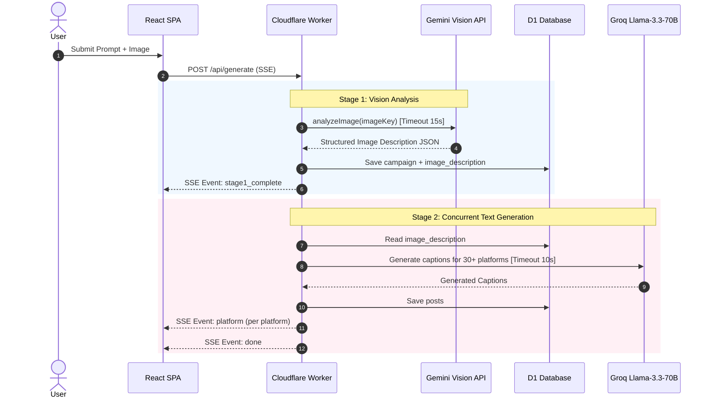

# Two-Stage AI Generation Pipeline Feature Spec

## Documentation Relationships

- **Depends On**:
  - [DOC-2026-001: System Architecture](file:///c:/Users/golde/OneDrive/Desktop/bypostmaker/docs/architecture/system-overview.md)
  - [DOC-2026-002: API Contract Spec](file:///c:/Users/golde/OneDrive/Desktop/bypostmaker/docs/api/postmaker-api-contract.md)
  - [DOC-2026-003: D1 Database Schema](file:///c:/Users/golde/OneDrive/Desktop/bypostmaker/docs/database/d1-schema-spec.md)
- **Used By**:
  - Main Post Creation Page ([`frontend/src/App.tsx`](file:///c:/Users/golde/OneDrive/Desktop/bypostmaker/frontend/src/App.tsx))

---

## AI Context & Guardrails

> [!IMPORTANT]
> **Strict Operational Invariants for AI Agents**

- **Purpose**: Architecture and execution contract for PostMaker's 2-stage multi-platform post generation.
- **Stage 1 (Vision)**: Executed in [`config/ai.ts`](file:///c:/Users/golde/OneDrive/Desktop/bypostmaker/config/ai.ts) (`analyzeImage()`). Sends uploaded image to Gemini (`env.GEMINI_API_KEY`) exactly once. Stores JSON description in `campaigns.image_description`.
- **Stage 2 (Caption Text)**: Executed in [`worker/src/routes/generate.ts`](file:///c:/Users/golde/OneDrive/Desktop/bypostmaker/worker/src/routes/generate.ts). Reads cached `image_description` from D1 and uses Groq (`llama-3.3-70b-versatile`) to generate multi-platform captions concurrently.
- **Constraints**: Cloudflare Worker execution cap is 30s. Stage 1 timeout is 15s; Stage 2 timeout is 10s.
- **DO NOT CHANGE**: Never combine Stage 1 and Stage 2 into a single loop or re-call Gemini vision during platform retries.

---

## Sequence Flow Diagram

---

## Evidence & Verification

| Claim / Behavior | Evidence Source | Verification Link / Code | Verified By | Last Verified |
| :--- | :--- | :--- | :--- | :--- |
| Stage 1 uses Gemini Vision API | AI Routing Module | [`config/ai.ts#L114-L217`](file:///c:/Users/golde/OneDrive/Desktop/bypostmaker/config/ai.ts#L114-L217) | AI Lead | 2026-07-31 |
| Stage 2 uses Groq `llama-3.3-70b-versatile` | Generate Route Handler | [`worker/src/routes/generate.ts#L40-L95`](file:///c:/Users/golde/OneDrive/Desktop/bypostmaker/worker/src/routes/generate.ts#L40-L95) | AI Lead | 2026-07-31 |
| Execution timeouts are explicitly bounded | Timeout Config | [`config/ai.ts#L30`](file:///c:/Users/golde/OneDrive/Desktop/bypostmaker/config/ai.ts#L30) | System Architect | 2026-07-31 |
