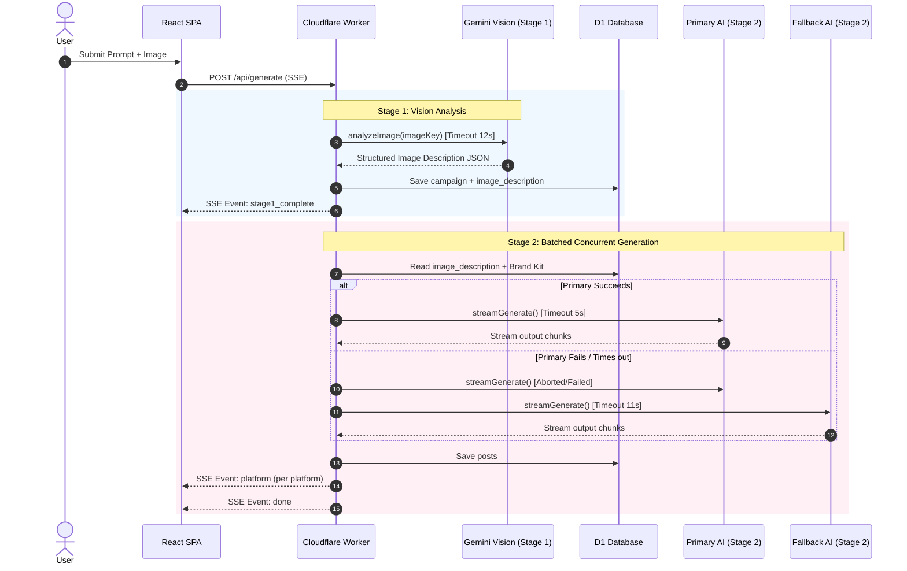

# Two-Stage AI Generation Pipeline Feature Spec

## Documentation Relationships

- **Depends On**:
  - [DOC-2026-001: System Architecture](file:///home/jaisankar/Documents/projects/bypostmaker/bypostmaker/docs/architecture/system-overview.md)
  - [DOC-2026-002: API Contract Spec](file:///home/jaisankar/Documents/projects/bypostmaker/bypostmaker/docs/api/postmaker-api-contract.md)
  - [DOC-2026-003: D1 Database Schema](file:///home/jaisankar/Documents/projects/bypostmaker/bypostmaker/docs/database/d1-schema-spec.md)
- **Used By**:
  - Main Post Creation Page ([`frontend/src/App.tsx`](file:///home/jaisankar/Documents/projects/bypostmaker/bypostmaker/frontend/src/App.tsx))

---

## AI Context & Guardrails

> [!IMPORTANT]
> **Strict Operational Invariants for AI Agents**

- **Purpose**: Architecture and execution contract for PostMaker's 2-stage multi-platform post generation.
- **Stage 1 (Vision)**: Executed in [`config/ai.ts`](file:///home/jaisankar/Documents/projects/bypostmaker/bypostmaker/config/ai.ts) (`analyzeImage()`). Sends uploaded image to Gemini (`env.GEMINI_API_KEY`) exactly once. Stores JSON description in `campaigns.image_description`.
- **Stage 2 (Caption Text Batching)**: Executed in [`worker/src/routes/generate.ts`](file:///home/jaisankar/Documents/projects/bypostmaker/bypostmaker/worker/src/routes/generate.ts). Consolidates 33 platforms into 3 execution batch buckets (`social`, `community_longform`, `media_design_messaging`).
- **Stage 2 Fallback (Failover)**: If primary model (Groq by default) fails or times out, the system automatically redirects the request to the fallback provider (Gemini by default) with an independent `AbortController`.
- **Fallback Override**: The fallback provider choice can be explicitly overridden via the `TEXT_FALLBACK_PROVIDER` env variable ("groq" | "gemini").
- **Dynamic Sizing**: Sub-batches are chunked by `caps.maxPlatformsPerBatch` (default 10). Dynamic token limit per chunk: `min(caps.maxOutputTokens - 256, max(512, rawOutputTokens))`.
- **Script Multipliers**: Non-Latin scripts use script-aware token multipliers (`hi`/`zh`/`ja`/`ko` 3.0x, `ar` 2.4x, `ru`/`el` 1.8x, `en` 1.0x) applied symmetrically to input and output token estimations.
- **2-Stage Fail-Soft Parsing**: Stage 1 `JSON.parse` with Stage 2 regex key-value fallback (`/"(platform_id)"\s*:\s*"((?:[^"\\]|\\.)*)"/g`). Platforms missing from both stages emit an explicit SSE `event: error`.
- **Constraints**: Cloudflare Worker execution cap is 30s. Stage 1 timeout is **12s**; Stage 2 primary timeout is **5s**; Stage 2 fallback timeout is **11s** (maximum sequential latency `12s + 5s + 11s = 28s`).
- **DO NOT CHANGE**: Never combine Stage 1 and Stage 2 into a single loop or re-call Gemini vision during platform retries.

---

## Execution Batch Mapping

| Execution Batch (`ExecutionBatch`) | Platforms (Total 33) | Default Chunk Sizing |
| :--- | :--- | :--- |
| `social` (11) | `twitter`, `threads`, `bluesky`, `mastodon`, `snapchat`, `lemon8`, `linkedin`, `facebook`, `instagram`, `tiktok`, `youtubeshorts` | 2 sub-batches (10 + 1) |
| `community_longform` (13) | `reddit`, `hackernews`, `producthunt`, `indiehackers`, `betalist`, `discord`, `devto`, `hashnode`, `github`, `stackoverflow`, `medium`, `substack`, `quora` | 2 sub-batches (10 + 3) |
| `media_design_messaging` (9) | `youtube`, `pinterest`, `twitch`, `clubhouse`, `dribbble`, `behance`, `telegram`, `slack`, `whatsapp` | 1 sub-batch (9) |

---

## Sequence Flow Diagram

---

## Evidence & Verification

| Claim / Behavior | Evidence Source | Verification Link / Code | Verified By | Last Verified |
| :--- | :--- | :--- | :--- | :--- |
| Stage 1 uses Gemini Vision API | AI Routing Module | [`config/ai.ts#L210-L325`](file:///home/jaisankar/Documents/projects/bypostmaker/bypostmaker/config/ai.ts#L210-L325) | AI Lead | 2026-08-06 |
| 3 Execution Batch Buckets | Platform Configuration | [`config/platforms.ts#L19-L58`](file:///home/jaisankar/Documents/projects/bypostmaker/bypostmaker/config/platforms.ts#L19-L58) | System Architect | 2026-08-06 |
| Script-Aware Multipliers & 2-Stage Fail-Soft Extractor | AI Helper Module | [`config/ai.ts#L74-L124`](file:///home/jaisankar/Documents/projects/bypostmaker/bypostmaker/config/ai.ts#L74-L124) | AI Lead | 2026-08-06 |
| Sub-Batch Chunking & SSE Error Emission | Generate Route Handler | [`worker/src/routes/generate.ts#L266-L340`](file:///home/jaisankar/Documents/projects/bypostmaker/bypostmaker/worker/src/routes/generate.ts#L266-L340) | Technical Lead | 2026-08-06 |
| Stage 2 Primary / Fallback Routing & Overrides | AI Client Wrapper | [`config/ai.ts#L385-L525`](file:///home/jaisankar/Documents/projects/bypostmaker/bypostmaker/config/ai.ts#L385-L525) | Tech Writing Lead | 2026-08-06 |

