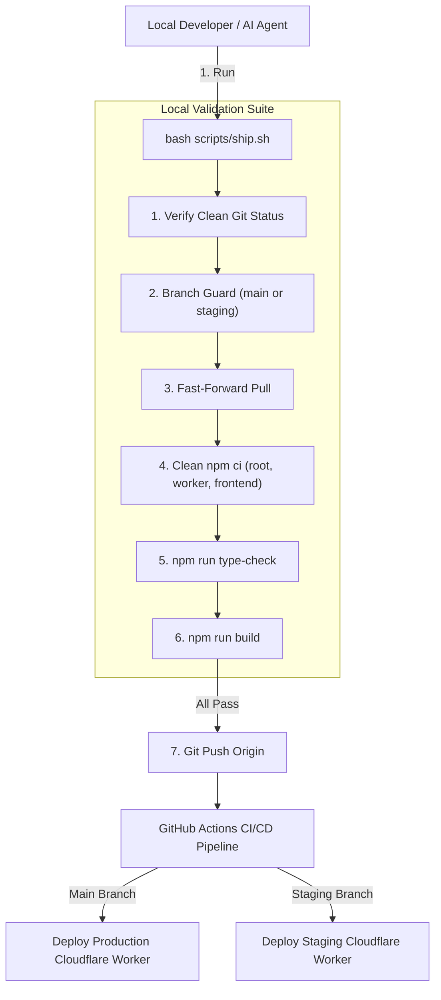

# Deployment Pipeline & Shipping Runbook

## Documentation Relationships

- **Depends On**:
  - [DOC-2026-001: System Architecture](file:///c:/Users/golde/OneDrive/Desktop/bypostmaker/docs/architecture/system-overview.md)
  - [DOC-2026-002: API Contract Spec](file:///c:/Users/golde/OneDrive/Desktop/bypostmaker/docs/api/postmaker-api-contract.md)

---

## AI Context & Guardrails

> [!IMPORTANT]
> **Strict Operational Runbook for Engineers & AI Agents**

- **Purpose**: Governs the ONLY authorized method to test, build, and deploy code to production or staging in the PostMaker repository.
- **Mandatory Script**: [`scripts/ship.sh`](file:///c:/Users/golde/OneDrive/Desktop/bypostmaker/scripts/ship.sh).
- **Constraints**: Never run manual `git push` directly to `staging` or `main`. Always execute `bash scripts/ship.sh`.
- **DO NOT CHANGE**: `scripts/ship.sh` step order (git clean check -> branch guard -> fast-forward pull -> `npm ci` -> `npm run type-check` -> `npm run build` -> `git push`).

---

## Deployment Pipeline Architecture



---

## Execution Instructions

Execute the following command to deploy:

```bash
bash scripts/ship.sh
```

### Pre-requisites & Verification Sequence
1. Commit all modified files.
2. Ensure working branch is `main` or `staging`.
3. If type-check or build fails, fix all TypeScript compilation errors before re-running `ship.sh`.

---

## Evidence & Verification

| Claim / Behavior | Evidence Source | Verification Link / Code | Verified By | Last Verified |
| :--- | :--- | :--- | :--- | :--- |
| `scripts/ship.sh` runs type-check & build | Script Source | [`scripts/ship.sh#L1-L60`](file:///c:/Users/golde/OneDrive/Desktop/bypostmaker/scripts/ship.sh#L1-L60) | DevOps Lead | 2026-07-31 |
