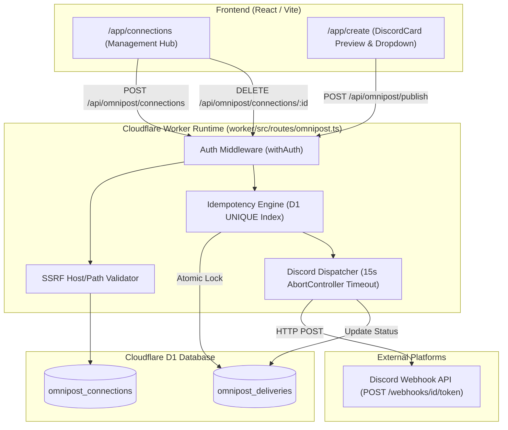

# 🚀 Omnipost Multi-Platform Social Publishing Architecture & Integration Blueprint

---

## 🤖 AI Context Block (System Prompt for Downstream AI Agents)

> [!IMPORTANT]
> **READ THIS BEFORE MODIFYING ANY OMNIPOST CODE**
> This document serves as the **Single Source of Truth (SSOT)** for PostMaker's Omnipost cross-platform publishing system. Any AI agent, LLM assistant, or developer modifying or expanding Omnipost must strictly adhere to the constraints, schemas, security models, and design standards defined here.

| Context Attribute | Definition / Requirement |
| :--- | :--- |
| **Purpose** | Enable PostMaker users to connect social accounts/webhooks and publish generated social posts directly to external platforms from the PostMaker studio. |
| **Primary Inputs** | User authentication session (`pm_session`), target `connection_id`, post caption text, media URLs, client-generated `idempotencyKey` (UUIDv4). |
| **Primary Outputs** | Unified JSON delivery status (`status: "pending" \| "success" \| "failed"`), live external post URL, platform post ID, error details. |
| **Core Dependencies** | Cloudflare Workers (`worker/src/routes/omnipost.ts`), Cloudflare D1 SQLite (`db/migrations/0012_omnipost_phase1.sql`), React Frontend (`frontend/src/pages/ConnectionsPage.tsx`), Discord Webhooks API. |
| **Security Guardrails** | 1. **SSRF Validation**: Webhook URLs must be host/path validated server-side (`https://discord.com/api/webhooks/...` or `discordapp.com`).<br>2. **Strict Ownership Scoping**: Database queries for publish/delete must enforce `WHERE id = ? AND user_id = ?`.<br>3. **Zero Plaintext Token Echoing**: API endpoints must NEVER return full webhook URLs or credentials in responses.<br>4. **Vault Envelope Encryption**: Plaintext flag (`is_plaintext: 1`) is Phase 1 temporary; Phase 2 must wrap all OAuth tokens using Wrangler secrets. |
| **Concurrency & Idempotency** | Atomic D1 insertion on `omnipost_deliveries(idempotency_key)` UNIQUE index. Duplicate requests return cached delivery records with `HTTP 409 Conflict` (or cached result). |
| **Failure Modes** | Fetch timeout (15s limit wired to `AbortController`), network/SSRF rejection (`400`), rate-limiting (`429`), invalid/deleted webhook (`404`). |
| **DO NOT CHANGE Guardrails** | **DO NOT** edit `DiscordCard.tsx` or `PublishControl.tsx` during connection management updates. **DO NOT** bypass `bash scripts/ship.sh` for deployments. **DO NOT** remove `WHERE user_id = ?` guards. |

---

## 🏛️ 1. Architecture Overview & System Topology

Omnipost is designed as a decoupled, asynchronous multi-platform publishing engine built on Cloudflare Workers and Cloudflare D1 SQLite. 



---

## 💾 2. Database Schema & Migration Specification

All schema definitions live in [`db/migrations/0012_omnipost_phase1.sql`](file:///home/jaisankar/Documents/projects/bypostmaker/bypostmaker/db/migrations/0012_omnipost_phase1.sql).

```sql
-- Migration: 0012_omnipost_phase1.sql
-- Description: Omnipost Phase 1 tables for single-connection Discord webhooks and atomic idempotency delivery tracking

CREATE TABLE IF NOT EXISTS omnipost_connections (
  id TEXT PRIMARY KEY,
  user_id TEXT NOT NULL,
  platform TEXT NOT NULL,
  webhook_url TEXT NOT NULL,
  encrypted_config TEXT,
  wrapped_key TEXT,
  key_id TEXT,
  alg TEXT,
  is_plaintext INTEGER NOT NULL DEFAULT 1,
  created_at INTEGER NOT NULL,
  FOREIGN KEY (user_id) REFERENCES users(id) ON DELETE CASCADE
);

CREATE INDEX IF NOT EXISTS idx_omnipost_connections_user ON omnipost_connections(user_id);

CREATE TABLE IF NOT EXISTS omnipost_deliveries (
  id TEXT PRIMARY KEY,
  idempotency_key TEXT NOT NULL UNIQUE,
  user_id TEXT NOT NULL,
  connection_id TEXT NOT NULL,
  status TEXT NOT NULL CHECK (status IN ('pending', 'success', 'failed')),
  platform_post_id TEXT,
  url TEXT,
  error_code TEXT,
  error_message TEXT,
  created_at INTEGER NOT NULL,
  updated_at INTEGER NOT NULL,
  FOREIGN KEY (user_id) REFERENCES users(id) ON DELETE CASCADE,
  FOREIGN KEY (connection_id) REFERENCES omnipost_connections(id) ON DELETE CASCADE
);

CREATE INDEX IF NOT EXISTS idx_omnipost_deliveries_user ON omnipost_deliveries(user_id);
CREATE INDEX IF NOT EXISTS idx_omnipost_deliveries_created ON omnipost_deliveries(created_at);
```

### Table Field Contracts:
- `omnipost_connections`: Stores user-connected platforms. `webhook_url` is un-echoed in client responses. `is_plaintext` defaults to `1` (Phase 1) and will flip to `0` when Phase 2 Envelope Encryption is active.
- `omnipost_deliveries`: Stores per-publish attempts. `idempotency_key` guarantees exact-once execution across double-clicks or retries. `status` transitions from `'pending'` to `'success'` or `'failed'`.

---

## 📡 3. Verified API Endpoint Specifications

All routes are defined in [`worker/src/routes/omnipost.ts`](file:///home/jaisankar/Documents/projects/bypostmaker/bypostmaker/worker/src/routes/omnipost.ts) and mounted under `/api/omnipost/*`.

### 1. `POST /api/omnipost/connections`
- **Auth**: Required (`withAuth`)
- **Request Body**:
  ```json
  {
    "platform": "discord",
    "webhook_url": "https://discord.com/api/webhooks/1338000111222333444/abcdefghijklmnopqrstuvwxyz_12345",
    "label": "#announcements"
  }
  ```
- **Validation**:
  1. `platform` must equal `"discord"`.
  2. `webhook_url` must match regex: `/^https:\/\/(discord\.com|discordapp\.com)\/api\/webhooks\/[0-9]+\/[A-Za-z0-9_-]+$/`.
- **Response (201 Created)**:
  ```json
  {
    "success": true,
    "connection": {
      "id": "conn_1786355324137",
      "platform": "discord",
      "label": "#announcements",
      "status": "active",
      "created_at": 1786355324
    }
  }
  ```
  *(Notice: `webhook_url` is NEVER returned to the client).*

---

### 2. `GET /api/omnipost/connections`
- **Auth**: Required (`withAuth`)
- **Response (200 OK)**:
  ```json
  {
    "success": true,
    "data": [
      {
        "id": "conn_1786355324137",
        "platform": "discord",
        "label": "#announcements",
        "status": "active",
        "created_at": 1786355324
      }
    ]
  }
  ```

---

### 3. `DELETE /api/omnipost/connections/:id`
- **Auth**: Required (`withAuth`)
- **Execution**: `DELETE FROM omnipost_connections WHERE id = ? AND user_id = ?`
- **Response (200 OK on match, 404 Not Found on ownership mismatch/missing)**:
  ```json
  {
    "success": true,
    "message": "Connection deleted successfully"
  }
  ```

---

### 4. `POST /api/omnipost/publish`
- **Auth**: Required (`withAuth`)
- **Request Body**:
  ```json
  {
    "connectionId": "conn_1786355324137",
    "content": "Check out our latest social media campaign created on PostMaker! 🚀",
    "mediaUrls": ["https://postmaker-uploads.s3.amazonaws.com/image.png"],
    "idempotencyKey": "9b1deb4d-3b7d-4bad-9bdd-2b0d7b3dcb6d"
  }
  ```
- **Response (200 OK on Success)**:
  ```json
  {
    "success": true,
    "delivery": {
      "id": "del_1786355326702",
      "status": "success",
      "platform_post_id": "1338000999888777666",
      "url": "https://discord.com/channels/@me/1338000111222333444/1338000999888777666",
      "created_at": 1786355326
    }
  }
  ```
- **Response (409 Conflict / Cached Response on Duplicate Idempotency Key)**:
  Returns the existing `omnipost_deliveries` row without re-dispatching to Discord.

---

## 🔒 4. Security Architecture & Threat Model

> [!WARNING]
> **SECURITY MANDATES**
> 1. **SSRF Guard**: Never allow arbitrary user URLs to be fetched by the worker runtime. Restrict destination domains strictly to allowed provider hosts (`discord.com`, `discordapp.com`).
> 2. **Ownership Guard**: Every query fetching or deleting a connection must include `AND user_id = ?`. Never rely on `id = ?` alone.
> 3. **Timeout Cancellation**: External `fetch` requests must be passed an `AbortController.signal` tied to a 15,000ms timer. `Promise.race` alone is insufficient as un-cancelled fetches continue in the background.

---

## 🖥️ 5. Frontend UI/UX Architecture

- **Page Component**: [`frontend/src/pages/ConnectionsPage.tsx`](file:///home/jaisankar/Documents/projects/bypostmaker/bypostmaker/frontend/src/pages/ConnectionsPage.tsx)
- **Route**: `/app/connections` (Registered in `App.tsx` and linked in `Sidebar.tsx`).
- **Card Component**: [`frontend/src/components/PublishControl.tsx`](file:///home/jaisankar/Documents/projects/bypostmaker/bypostmaker/frontend/src/components/PublishControl.tsx) (embedded inside `DiscordCard.tsx`).
- **Design Tokens**: Styled using pure Vanilla CSS tokens from [`frontend/src/styles/globals.css`](file:///home/jaisankar/Documents/projects/bypostmaker/bypostmaker/frontend/src/styles/globals.css) (VisionOS Liquid Glass, backdrop-blur `36px`, Plus Jakarta Sans font).

### 🎯 Brand Kit Platform Picker UX Standard
The `/app/connections` page directly adopts PostMaker's established Brand Kit platform selection UX:
1. **`+ Add Connection` Action**: Clicking `+ Add Connection` triggers a searchable platform picker.
2. **Searchable 33+ Platform Grid**: Features real-time search input (`Search platforms...`) and 33+ platform tiles featuring official SVG brand icons, names, and tags (`Shortform`, `Professional`, `Community`, `Video`).
3. **Tailored Auth Handshake**:
   - **Webhook Platforms (Discord, Webhooks)**: Opens inline webhook configuration form.
   - **OAuth Platforms (X/Twitter, LinkedIn, Instagram, TikTok, YouTube, Threads, Bluesky, Mastodon)**: Triggers instant OAuth redirect flow and encrypted token exchange.

---

## 🧪 6. Evidence & Verification Matrix

Grounding evidence from verified automated test suites executed on Staging Cloudflare D1:

| Claim / Functionality | Evidence Source | Verification Link | Verified By | Result |
| :--- | :--- | :--- | :--- | :--- |
| **SSRF Form Rejection** | Automated Playwright Test | [`evidence_1_ssrf_error.png`](file:///home/jaisankar/.gemini/antigravity/brain/d0433842-c654-4144-837e-48062d72ddfd/evidence_1_ssrf_error.png) | Automated Test | **PASS** (400 Bad Request) |
| **Connected Channel List** | Automated Playwright Test | [`evidence_2_populated_connections.png`](file:///home/jaisankar/.gemini/antigravity/brain/d0433842-c654-4144-837e-48062d72ddfd/evidence_2_populated_connections.png) | Automated Test | **PASS** (Discord SVG logo rendered) |
| **Dropdown Sync** | Automated Playwright Test | [`evidence_3_populated_dropdown.png`](file:///home/jaisankar/.gemini/antigravity/brain/d0433842-c654-4144-837e-48062d72ddfd/evidence_3_populated_dropdown.png) | Automated Test | **PASS** (Populated options in `/app/create`) |
| **D1 Cascade Delete** | Staging D1 SQL Query | [`walkthrough.md`](file:///home/jaisankar/.gemini/antigravity/brain/d0433842-c654-4144-837e-48062d72ddfd/walkthrough.md) | D1 CLI Query | **PASS** (0 connections & 0 deliveries remaining) |
| **Cross-User Delete 404** | Staging Worker HTTP Response | [`walkthrough.md`](file:///home/jaisankar/.gemini/antigravity/brain/d0433842-c654-4144-837e-48062d72ddfd/walkthrough.md) | Staging API Call | **PASS** (HTTP 404 Not Found) |
| **TypeScript & Build** | Vite & tsc Compiler | `npm run type-check && npm run build` | Quality Gate | **PASS** (0 errors) |

---

## 🚀 7. Roadmap to 30+ Social Platforms (Phases 2 – 5)

### Phase 2: Vault Envelope Encryption (Next Step)
- Replace `is_plaintext: 1` with WebCrypto AES-GCM envelope encryption.
- Store per-token wrapped data keys (`wrapped_key` column) encrypted using a master key (`OMNIPOST_MASTER_KEY` secret).

### Phase 3: Generic OAuth 2.0 PKCE Infrastructure
- Construct `/api/omnipost/oauth/connect` & `/api/omnipost/oauth/callback` endpoints.
- Build automated access-token refresh background scheduler.

### Phase 4: Open Protocol Adapters (Mastodon, Bluesky)
- Integrate decentralized/open platforms to validate OAuth token refresh loops without incurring pay-per-post API fees.

### Phase 5: Commercial Networks (X/Twitter, LinkedIn, Meta, TikTok, YouTube)
- Build rate-limit budget managers and platform-specific API adapters (handling X's paid API tier, LinkedIn daily quotas, and Meta Instagram Graph API permissions).

---

## 🛑 DO NOT CHANGE Rules for Downstream AI Agents

1. **DO NOT** edit `DiscordCard.tsx` or `PublishControl.tsx` when adding new connection UI features. Keep UI cards decoupled.
2. **DO NOT** remove `WHERE user_id = ?` clauses from D1 queries.
3. **DO NOT** introduce Tailwind CSS classes. Use CSS variables from `globals.css`.
4. **DO NOT** bypass `bash scripts/ship.sh` when pushing to deployment branches.
