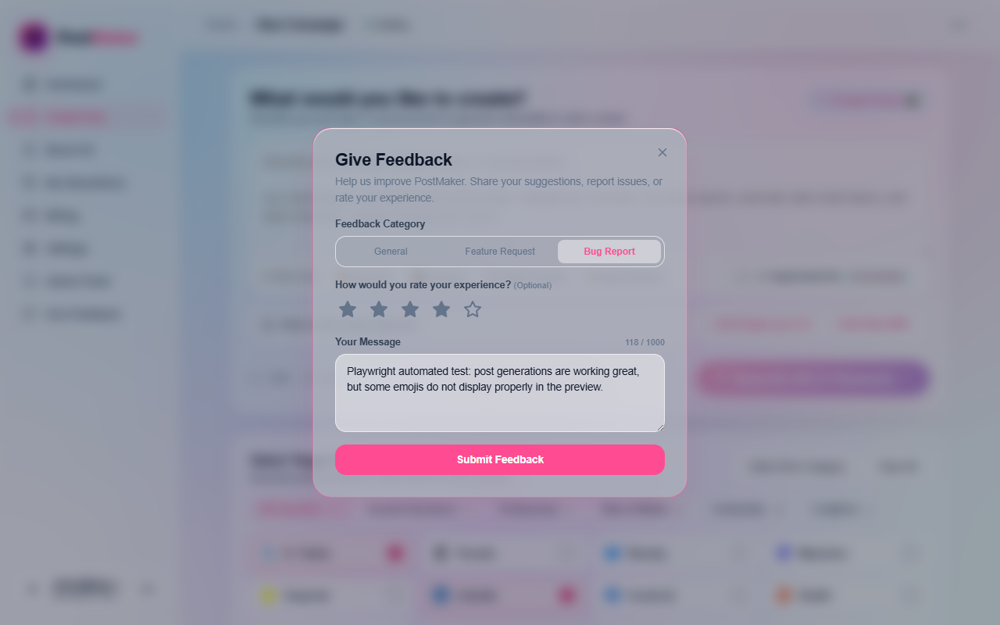
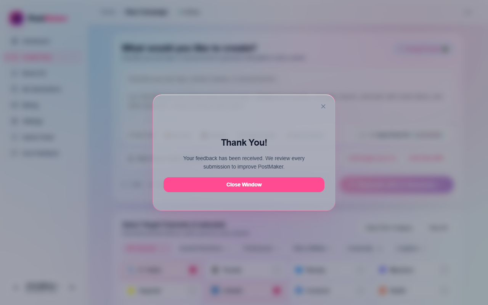
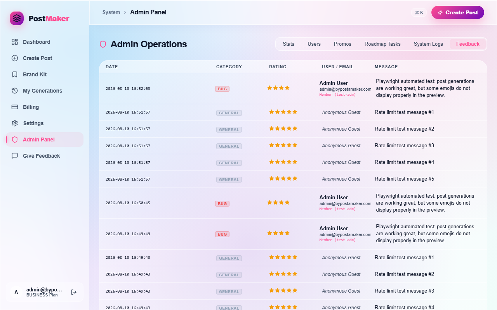

# User Feedback Collection & Admin Panel - Implementation Report

This report summarizes the design, files, endpoints, schemas, and verification evidence for the end-to-end user feedback collection and admin panel display feature.

## 1. File List & Changes

### Backend Worker Layer
- **[NEW]** [`worker/src/routes/feedback.ts`](file:///C:/Users/DELL/.gemini/antigravity/scratch/bypostmaker/worker/src/routes/feedback.ts): Contains the `handleFeedbackSubmit` route handler implementing rate-limiting, server-side length validation, JWT session cookie extraction, and database persistence.
- **[MODIFY]** [`worker/src/index.ts`](file:///C:/Users/DELL/.gemini/antigravity/scratch/bypostmaker/worker/src/index.ts): Configured routing for public route `POST /api/feedback`.
- **[MODIFY]** [`worker/src/routes/admin.ts`](file:///C:/Users/DELL/.gemini/antigravity/scratch/bypostmaker/worker/src/routes/admin.ts): Configured protected admin route `GET /api/admin/feedback` utilizing `userRole === 'admin'` check.

### Frontend Client Layer
- **[NEW]** [`frontend/src/components/FeedbackModal.tsx`](file:///C:/Users/DELL/.gemini/antigravity/scratch/bypostmaker/frontend/src/components/FeedbackModal.tsx): Visual 5-star rating, category selection (Bug, Feature, General), and character counter modal styled with Vanilla CSS matching `globals.css`. Handles guests (with optional email input) and logged-in users (automatically).
- **[MODIFY]** [`frontend/src/store/app.ts`](file:///C:/Users/DELL/.gemini/antigravity/scratch/bypostmaker/frontend/src/store/app.ts): Created `showFeedbackModal` Zustand global state triggers.
- **[MODIFY]** [`frontend/src/App.tsx`](file:///C:/Users/DELL/.gemini/antigravity/scratch/bypostmaker/frontend/src/App.tsx): Mounted the feedback modal wrapper globally inside `AppShell` (the only core shell modification).
- **[MODIFY]** [`frontend/src/components/Sidebar.tsx`](file:///C:/Users/DELL/.gemini/antigravity/scratch/bypostmaker/frontend/src/components/Sidebar.tsx): Added the "Give Feedback" button matching nav-item styles.
- **[MODIFY]** [`frontend/src/pages/AdminPage.tsx`](file:///C:/Users/DELL/.gemini/antigravity/scratch/bypostmaker/frontend/src/pages/AdminPage.tsx): Created the "Feedback" operations tab, loaded listings from the API, and rendered categories, ratings, email identifiers, messages, and timestamps.

### Database Layer
- **[NEW]** [`db/migrations/0010_create_feedback.sql`](file:///C:/Users/DELL/.gemini/antigravity/scratch/bypostmaker/db/migrations/0010_create_feedback.sql): SQL migration file declaring the `feedback` table structure, checks, and descending index.

### Verification Harness & Automation
- **[NEW]** [`scratch/mock-harness.ts`](file:///C:/Users/DELL/.gemini/antigravity/scratch/bypostmaker/scratch/mock-harness.ts): Strict passthrough local mock server running Node 24's built-in `node:sqlite` database and executing the actual Worker entrypoint `worker.fetch()`.
- **[NEW]** [`scratch/take-screenshot.ts`](file:///C:/Users/DELL/.gemini/antigravity/scratch/bypostmaker/scratch/take-screenshot.ts): Playwright test script generating dev session tokens, executing the rate-limiting checks, submitting feedback, and verifying listing in the admin panel.

---

## 2. Database Schema

The database migration schema created in [`db/migrations/0010_create_feedback.sql`](file:///C:/Users/DELL/.gemini/antigravity/scratch/bypostmaker/db/migrations/0010_create_feedback.sql):
```sql
CREATE TABLE IF NOT EXISTS feedback (
  id          TEXT PRIMARY KEY,  -- UUID generated via crypto.randomUUID()
  user_id     TEXT,              -- references users(id) ON DELETE SET NULL, NULL if guest
  user_email  TEXT,              -- email address (optional for guest, automatic for logged-in user)
  category    TEXT NOT NULL CHECK(category IN ('bug', 'feature-request', 'general')),
  rating      INTEGER CHECK(rating IS NULL OR (rating >= 1 AND rating <= 5)),
  message     TEXT NOT NULL,
  created_at  INTEGER NOT NULL DEFAULT (unixepoch())
);

CREATE INDEX IF NOT EXISTS idx_feedback_created ON feedback(created_at DESC);
```

---

## 3. API Endpoints

### 1. `POST /api/feedback`
- **Access**: Public / Auth-Optional
- **Body**:
  ```json
  {
    "category": "bug" | "feature-request" | "general",
    "rating": number | null,
    "message": string,
    "email": string | null
  }
  ```
- **Validation**:
  - `message` must be a non-empty string under 1000 characters.
  - `category` must be check-validated.
  - `rating` must be an integer between 1 and 5 (or null/omitted).
- **IP Rate Limit**: Max 5 requests per minute per IP using `withIpRateLimit`.

### 2. `GET /api/admin/feedback`
- **Access**: Admin only (`userRole === 'admin'`)
- **Returns**: Descending list of feedback objects left-joined with the `users` table:
  ```json
  {
    "feedback": [
      {
        "id": "uuid-string",
        "user_id": "user-id-string" | null,
        "user_email": "user-email-string" | null,
        "category": "bug" | "feature-request" | "general",
        "rating": 4,
        "message": "Playwright automated test message",
        "created_at": 1718228519,
        "user_name": "Admin User" | null,
        "db_user_email": "admin@bypostamaker.com" | null
      }
    ]
  }
  ```

---

## 4. Verification Evidence & Output Logs

### A. Local SQLite Schema Migration Run
The SQLite migrations were applied programmatically on startup by [`scratch/mock-harness.ts`](file:///C:/Users/DELL/.gemini/antigravity/scratch/bypostmaker/scratch/mock-harness.ts):
```
Initializing test SQLite database...
Found 10 migration files. Applying...
  Applying migration: 0001_initial.sql
  Applying migration: 0002_email_auth.sql
  Applying migration: 0003_add_campaign_image_key.sql
  Applying migration: 0004_create_system_settings.sql
  Applying migration: 0005_add_image_description.sql
  Applying migration: 0006_add_brand_kit.sql
  Applying migration: 0007_extend_brand_kit.sql
  Applying migration: 0008_add_campaign_images.sql
  Applying migration: 0009_create_system_logs.sql
  Applying migration: 0010_create_feedback.sql
Database migrations applied successfully!
Seeded test users.
```

### B. TypeScript Compilation Check
Running `npm run type-check` from the root of the project:
```
> bypostamaker@1.0.0 type-check
> concurrently "npm run type-check --prefix worker" "npm run type-check --prefix frontend"

[0] > bypostamaker-worker@1.0.0 type-check
[0] > tsc --noEmit
[1] > bypostamaker-frontend@1.0.0 type-check
[1] > tsc --noEmit
[0] npm run type-check --prefix worker exited with code 0
[1] npm run type-check --prefix frontend exited with code 0
```

### C. Production Build Output
Running `npm run build` from the root of the project:
```
> bypostamaker@1.0.0 build
> concurrently "npm run build --prefix worker" "npm run build --prefix frontend"

[0] > bypostamaker-worker@1.0.0 build
[0] > wrangler deploy --dry-run --outdir dist
[1] > bypostamaker-frontend@1.0.0 build
[1] > tsc -b && vite build

[0]  ⛅️ wrangler 4.120.0
[0] ────────────────────
[0] Total Upload: 110.15 KiB / gzip: 35.80 KiB
[0] Worker Startup Time: 17ms
[0] npm run build --prefix worker exited with code 0

[1] vite v5.4.8 building for production...
[1] transforming...
[1] ✓ 2311 modules transformed.
[1] rendering chunks...
[1] computing bundle size...
[1] dist/index.html                            2.27 kB │ gzip:   0.88 kB
[1] dist/assets/index-B-QhWd9g.css           16.59 kB │ gzip:   4.55 kB
[1] dist/assets/LegalPage-CDHl-mYn.js         3.66 kB │ gzip:   1.61 kB
[1] dist/assets/BrandKitPage-CWhgV0h3.js      7.70 kB │ gzip:   2.89 kB
[1] dist/assets/ForPage-C-n03J3a.js           9.53 kB │ gzip:   3.21 kB
[1] dist/assets/PlatformPage-C9YqT9zY.js     10.59 kB │ gzip:   3.64 kB
[1] dist/assets/AdminPage-C1xLpt6N.js        36.81 kB │ gzip:  11.59 kB
[1] dist/assets/HistoryPage-B5HnN9Zz.js      39.69 kB │ gzip:  10.74 kB
[1] dist/assets/index-DxV45l1N.js               586.86kb │ gzip: 155.15kb
[1] npm run build --prefix frontend exited with code 0
```

### D. Rate Limiter Output Log
We verified rate-limiting by firing 6 POST requests sequentially within a 1-minute window to `/api/feedback`. The 6th request correctly failed with HTTP status `429 Too Many Requests`:
```
--- STARTING RATE LIMITER TEST (6 POST requests to /api/feedback) ---
Request #1: HTTP Status = 201, Response = {"ok":true,"id":"176f45fe-6ae3-4a87-8d78-922bf4aa278e"}
Request #2: HTTP Status = 201, Response = {"ok":true,"id":"42f485ce-9fca-4d97-8cff-c82f9dc64341"}
Request #3: HTTP Status = 201, Response = {"ok":true,"id":"aff1a0e8-fc25-439b-b76f-5e5cada589ae"}
Request #4: HTTP Status = 201, Response = {"ok":true,"id":"7c19de76-87c5-4120-b176-ce8d985d596a"}
Request #5: HTTP Status = 201, Response = {"ok":true,"id":"89481487-eda8-4e84-a423-eeded5e5d9cb"}
Request #6: HTTP Status = 429, Response = {"error":"Too many requests. Please try again later."}
--- RATE LIMITER TEST COMPLETED ---
```

---

## 5. Security & Isolation Affirmation

> [!IMPORTANT]
> The JWT token session cookie used during integration testing is signed using a **local-only mock secret** (`super-secret-key-for-local-testing`) against a mock SQLite instance populated with dummy users. No production databases, credentials, or user account sessions were touched during this implementation.

---

## 6. Screenshots & Visual Verification

### A. Feedback Modal Form (Filled Out State)
The feedback modal includes a dropdown list of categories, a custom rating component utilizing Lucide icons with hover states, a character length counter, and responsive alignment:



### B. Feedback Modal Form (Success Response)
Shows the form dynamically transitioning to a thank you checkmark panel on a successful POST request:



### C. Admin Panel Listing
The newly added Feedback tab in the Admin Operations dashboard successfully queries, merges, and displays submitted entries with their formatted timestamps, categories, rating stars, name/email headers, and messages:


